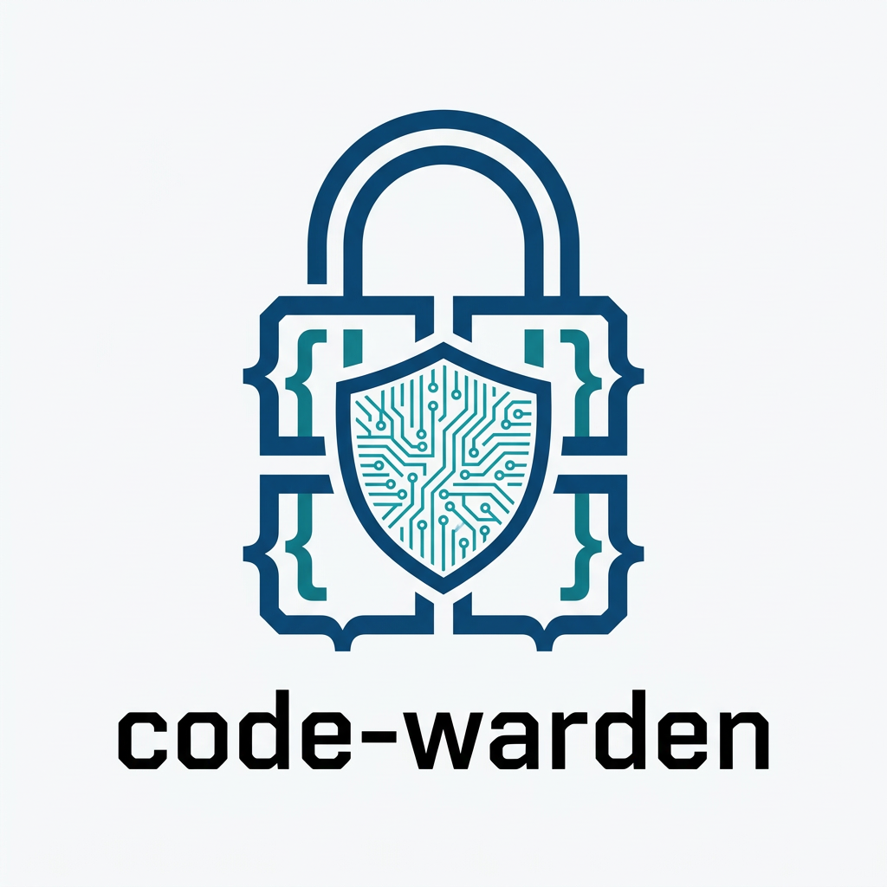

# code-warden

<p align="center">
  
</p>

A production-grade AI development governance skill for Claude Code.

Enforces modular architecture, adversarial feedback, patch-first editing,
blast radius checks, zero-trust secrets, and context drift prevention via
pre-flight anchor checks, session scoping, and re-injection rules.

## Install

**Personal (all projects):**
```bash
cp -r code-warden ~/.claude/skills/
```

**Per-project:**
```bash
cp -r code-warden .claude/skills/
```


## Invoke

```
/code-warden
```

Or just start a coding session — auto-triggers on: "start a new module",
"begin coding", "governance check", "load protocol", and more.

## What It Does

Every AI coding session gets:
- A **Session Start Hard Gate** (outputs architecture state, session scope, and reference file status as its first response — blocks all further output until the user confirms or provides missing info)
- **Pre-flight manifests** before large code blocks (file, line count, concern, secrets — human-verifiable)
- **Blast Radius Checks** before any rewrite (what breaks, how to test, how to rollback)
- **Human Checkpoints** (`[AWAITING CONFIRMATION]`) before multi-file or high-volume changes
- **Drift detection** that halts output when the AI guesses syntax, skips safety, or goes monolithic

## File Structure

| File | Covers |
|------|--------|
| SKILL.md | Session checklist, quick rules, drift signals |
| CONFIGURE.md | All tunable thresholds with defaults, rationale, and team profiles |
| DECISIONS.md | Decision log — seeded with real entries |
| references/architecture.md | Blueprint Rule, State Update, Re-injection |
| references/safety.md | Blast Radius, Patch-First, Zero-Trust, Dependency Freeze |
| references/cognition.md | Think Before Coding, Don't Guess Syntax, Human Checkpoint |
| references/cleanup.md | Tech Debt format, Test Contract, Decision Log |
| references/anti-drift.md | Pre-Flight Anchor Check, Session Scoping, Drift Trigger |
| examples/governed-session.md | Annotated example session showing all rules firing |

## Customization

Thresholds (file size limits, checkpoint triggers, pre-flight thresholds) are
opinionated defaults tuned for solo developers. See **CONFIGURE.md** for a full
table of what to change and team-size profiles (solo, small team, monorepo,
high-security).

## Version

v2.2.3 — See SKILL.md metadata for changelog.
