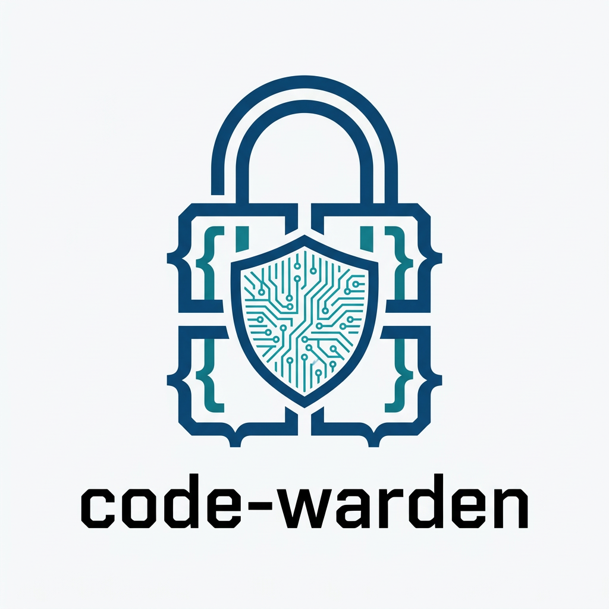

# code-warden

<p align="center">
  
</p>

[](https://github.com/Kodaxadev/Code-Warden/actions/workflows/code-warden.yml)

A production-grade AI development governance skill for Codex, Claude Code, and Cowork.

Enforces modular architecture, adversarial feedback, patch-first editing,
blast-radius checks, zero-trust secrets, and context-drift prevention through
pre-flight anchor checks, session scoping, and re-injection rules.

## Install

```bash
git clone https://github.com/Kodaxadev/Code-Warden.git
cd Code-Warden/code-warden
node install.js
```

The auto-installer scans for installed AI apps and deploys to all of them in one step.
Supports Claude Code, Cursor, Warp, OpenAI Codex, Windsurf, and generic agent runtimes.

### Installer commands

| Command | Purpose |
|---------|---------|
| `node install.js` | Scan, prompt, install to all detected apps |
| `node install.js --all` | Install without prompt |
| `node install.js --dry-run` | Preview installs, write nothing |
| `node install.js --list` | Show detected apps with detection method |
| `node install.js --doctor` | Verify source integrity and installed health |
| `node install.js --target=claude,cursor` | Force specific targets (warns if not detected) |

Or via npm:

```bash
npm run install-auto       # install to all detected
npm run install-dry-run    # preview only
```

### Legacy / manual install

```powershell
.\install.ps1              # agents (default)
.\install.ps1 -Target claude
```

```bash
bash install.sh            # agents (default)
bash install.sh claude
```

## Invoke

```
/code-warden
```

Or start a coding session with phrases like "start a new module", "begin coding",
"governance check", "load protocol", or "load code-warden".

## What It Does

Every AI coding session gets:
- A **Session Start Hard Gate** that outputs architecture state, session scope, and reference file status before implementation.
- **Pre-flight manifests** before large code blocks.
- **Blast Radius Checks** before rewrites.
- **Human Checkpoints** (`[AWAITING CONFIRMATION]`) before multi-file or high-volume changes.
- **Drift detection** when the agent guesses syntax, skips safety, or goes monolithic.

## File Structure

| File | Covers |
|------|--------|
| `SKILL.md` | Session checklist, quick rules, drift signals |
| `CONFIGURE.md` | Tunable thresholds, rationale, team profiles |
| `DECISIONS.md` | Decision log |
| `references/architecture.md` | Blueprint Rule, State Update, Re-injection |
| `references/safety.md` | Blast Radius, Patch-First, Zero-Trust, Dependency Freeze |
| `references/cognition.md` | Think Before Coding, Don't Guess Syntax, Human Checkpoint |
| `references/cleanup.md` | Tech Debt format, Test Contract, Decision Log |
| `references/anti-drift.md` | Pre-Flight Anchor Check, Session Scoping, Drift Trigger |
| `references/operations.md` | Verification evidence, source-control hygiene, dependency control, evidence standards |
| `references/research-and-fit.md` | Live research gate, stack fit checks, product-shape guardrails |
| `examples/governed-session.md` | Annotated example session |

## Customization

Thresholds are opinionated defaults tuned for solo developers. See
`code-warden/CONFIGURE.md` for the full table and team-size profiles.

## CI Integration

Add code-warden enforcement to any GitHub Actions pipeline:

```yaml
- name: Install Code-Warden
  run: |
    curl -fsSL -o cw.zip \
      https://github.com/Kodaxadev/Code-Warden/releases/download/v2.7.0/code-warden-v2.7.0.zip
    unzip -q cw.zip -d .code-warden-ci

- name: Lint — file length limits
  run: node .code-warden-ci/tools/warden-lint.js .

- name: Secrets — zero-trust scan
  run: node .code-warden-ci/tools/verify-secrets.js .
```

Full template: [`code-warden/templates/ci/github-actions.yml`](code-warden/templates/ci/github-actions.yml)

Or run locally:

```bash
npm run ci   # lint + secrets + doctor in one command
```

## Version

v2.7.0 - See `code-warden/SKILL.md` metadata for changelog.
