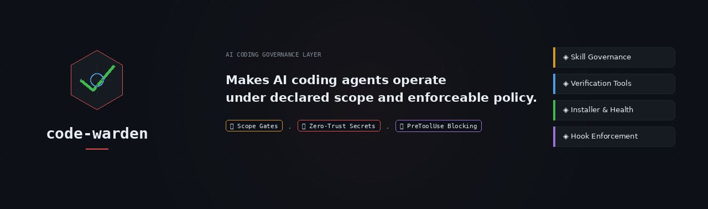

# code-warden

<p align="center">
  <a href="https://github.com/Kodaxadev/Code-Warden/actions/workflows/code-warden.yml">
    
  </a>
  
  
  
  
  <a href="https://www.npmjs.com/package/code-warden">
    
  </a>
  <a href="https://socket.dev/npm/package/code-warden">
    
  </a>
</p>

<p align="center">
  
</p>

## Quickstart

```bash
npx code-warden init
```

Generate a governance report:

```bash
npx code-warden report
```

Enable hard hooks where supported:

```bash
npx code-warden hooks claude
npx code-warden hooks codex
```

## Who This Is For

**Code-Warden is for when AI coding stops being autocomplete and starts being delegated work.**

If you run short, supervised one-file AI edits, Code-Warden may be overkill.

If you run long Claude Code, Codex, or Cursor sessions — multi-file refactors, parallel projects, CI-gated work, or client and product code — Code-Warden gives your agent declared scope, verifiable checks, and enforceable safety rails.

**Built for developers who:**
- Run long, high-autonomy AI coding sessions
- Let agents touch multiple files or whole modules
- Work across several projects at once
- Need CI-friendly verification without relying on chat memory
- Need an audit trail for what the agent was allowed to change
- Want hard blocking where the runtime supports it

**Probably overkill if:**
- You only use AI for short snippets
- You manually review every one-file edit before it lands
- You do not need CI checks
- You are comfortable relying entirely on prompt instructions

## Prevents / Allows

**Prevents**
- Code before scope is declared
- Multi-file edits without a patch plan
- Files touched outside approved scope
- Oversized monolithic files
- Hardcoded API keys and credentials
- Completion claims without verification evidence
- Stale or broken agent installs
- Claude Code writes that violate hook policy

**Allows**
- Normal development work
- Fast solo-founder iteration
- Existing agent workflows
- CI enforcement without chat memory
- Optional hard blocking only where supported

## Four Layers

<p align="center">
  
</p>

## Compatibility

| Runtime | Install | Skill Rules | Local Tools | CI | Hard Hooks |
|---|---:|---:|---:|---:|---:|
| Claude Code | ✅ | ✅ | ✅ | ✅ | ✅ PreToolUse |
| OpenAI Codex | ✅ | ✅ | ✅ | ✅ | ⚡ Partial |
| Cursor | ✅ | ✅ | ✅ | ✅ | — |
| Warp | ✅ | ✅ | ✅ | ✅ | — |
| Windsurf | ✅ flat rules | ✅ adapted | ✅ | ✅ | — |
| Generic Agents | ✅ | ✅ | ✅ | ✅ | — |
| GitHub Actions | — | — | ✅ | ✅ | — |

Claude Code gets full hard enforcement (blocks `Write`/`Edit` before the file system is touched). Codex gets partial enforcement: `apply_patch` and `Bash` calls are intercepted for secrets and estimated file size — the tool surfaces Codex exposes at `PreToolUse`. CI enforcement closes the remaining gap for both runtimes.

## Why Not Just Prompt Better?

You should prompt well. Code-Warden does not replace that.

**Prompts are policy. Code-Warden adds verification and enforcement.**

| Rule | Prompt-only | Code-Warden |
|---|---|---|
| Keep files modular | Agent remembers | `warden-lint` checks files and directories |
| No hardcoded secrets | Agent remembers | `verify-secrets` scans locally and in CI |
| Stay inside scope | Agent declares scope | Scope Gate creates an explicit file contract |
| Verify before done | Agent claims it checked | `npm run ci` produces a deterministic result |
| Block unsafe writes | Not possible everywhere | Claude `PreToolUse` hooks deny `Write`/`Edit` before execution |

Code-Warden is portable at the governance, installer, local-tooling, and CI layers. Hard pre-write blocking is currently Claude Code-specific because Claude exposes `PreToolUse` hooks. Other runtimes get all other layers.

## What Code-Warden Is / Is Not

**Code-Warden is:**
- A governance layer for AI coding agents
- A local verification toolkit
- A cross-runtime installer and health checker
- A CI-friendly policy gate
- An optional hard-enforcement layer for Claude Code (full) and Codex (partial)

**Code-Warden is not:**
- A replacement for your coding agent
- A full development methodology like Superpowers
- A sandbox or security boundary against malicious users
- A guarantee that unsupported runtimes can block tool calls before execution

> Code-Warden governs the agent inside the workflow you already use.

## Adoption Path

You do not need to install everything at once. Each layer adds value independently.

1. **CI only** — add `warden-lint` and `verify-secrets` to GitHub Actions. No skill install required.
2. **Skill governance** — install Code-Warden into your AI runtime. Scope Gates, Plan Gates, and drift signals activate immediately.
3. **Hard enforcement** — enable hooks for pre-tool-use blocking. Claude Code: full (`Write`/`Edit`). Codex: partial (`apply_patch`/`Bash`). Requires step 2 first.

Start where you have the most immediate pain.

## Install

```bash
npx code-warden init
```

Or install globally:

```bash
npm install -g code-warden
code-warden init
```

The installer scans for AI runtimes and deploys to all of them in one step.
Supports Claude Code, Cursor, Warp, OpenAI Codex, Windsurf, and generic agent runtimes.

### CLI commands

```bash
code-warden init              # install to detected AI runtimes
code-warden report            # generate governance report
code-warden report --format=md # Markdown output (pipe to PR summary)
code-warden doctor            # verify source + install health
code-warden list              # show detected runtimes
code-warden hooks claude      # install Claude Code PreToolUse hooks
code-warden hooks codex       # install Codex PreToolUse hooks (partial)
code-warden uninstall-hooks claude
code-warden uninstall-hooks codex
```

## Invoke

```
/code-warden
```

Or: `"load code-warden"`, `"new session"`, `"begin coding"`, `"governance check"`.

### Session Start Sequence

<p align="center">
  
</p>

## Optional Hard Enforcement (Hooks)

<p align="center">
  
</p>

### Claude Code — Full enforcement

```bash
node install.js --hooks=claude           # install (requires Claude target installed first)
node install.js --uninstall-hooks=claude # remove
```

Blocks `Write` and `Edit` before the file system is touched — if the resulting file would exceed the line limit or contain a hardcoded credential.

### OpenAI Codex — Partial enforcement

```bash
node install.js --hooks=codex            # install (requires Codex target installed first)
node install.js --uninstall-hooks=codex  # remove
```

| Hook | Trigger | Policy |
|------|---------|--------|
| `warden-apply-patch-hook.js` | `apply_patch` | Blocks if added lines contain a credential or estimated result exceeds line limit |
| `warden-bash-hook.js` | `Bash` | Blocks if command contains a hardcoded credential |

Codex exposes `apply_patch` and `Bash` at `PreToolUse` — not `Write`/`Edit`. These are the available surfaces. CI enforcement closes the remaining gap.

Doctor and `--verify-target=<id>` validate hook script paths when hooks are registered.

## Governance Evidence

Code-Warden produces a machine-readable governance report — verifiable evidence that checks ran and passed:

```bash
node tools/governance-report.js .              # writes .code-warden-report.json
node tools/governance-report.js . --format=md  # Markdown table for PR summaries
```

The report covers file length, hardcoded credentials, behavioral tests, source integrity, and runtime hook status in a single pass. In CI, it pipes directly into `$GITHUB_STEP_SUMMARY` so every PR shows what was checked.

## CI Integration

Use Code-Warden as a GitHub Action:

```yaml
- name: Code-Warden Governance Gate
  uses: Kodaxadev/Code-Warden@v3
  with:
    path: .
```

The action writes `.code-warden-report.json`, appends a Markdown summary to the
workflow run, and uploads the report as an artifact by default.

Or download a pinned release directly:

```yaml
- name: Install Code-Warden
  run: |
    curl -fsSL -o cw.zip \
      https://github.com/Kodaxadev/Code-Warden/releases/download/v3.3.2/code-warden-v3.3.2.zip
    unzip -q cw.zip -d .code-warden-ci

- name: Governance report
  run: node .code-warden-ci/tools/governance-report.js .

- name: Publish governance summary
  if: always()
  run: node .code-warden-ci/tools/governance-report.js . --format=md >> $GITHUB_STEP_SUMMARY

- name: Upload governance artifact
  if: always()
  uses: actions/upload-artifact@v4
  with:
    name: code-warden-report
    path: .code-warden-report.json
    retention-days: 90
```

Full template: [`code-warden/templates/ci/github-actions.yml`](code-warden/templates/ci/github-actions.yml)

## Release Trust

Code-Warden releases are tag-driven. The release workflow verifies the package
version matches the pushed tag, runs the governance gate, performs an npm
publish dry run, publishes to npm through trusted publishing, creates a GitHub
release, and uploads the versioned zip asset.

Trusted publishing uses GitHub Actions OIDC instead of a long-lived npm token
and lets npm attach provenance to public package publishes from public
repositories.

## File Structure

| File | Purpose |
|------|---------|
| `SKILL.md` | Session gates, quick rules, drift signals, reference index |
| `CONFIGURE.md` | Tunable thresholds and team-size profiles |
| `DECISIONS.md` | Architecture decision log |
| `references/planning-gates.md` | Scope Gate and Plan Gate contracts |
| `references/architecture.md` | Blueprint Rule, Re-injection, State Update |
| `references/safety.md` | Blast Radius, Patch-First, Zero-Trust, Dependency Freeze |
| `references/cognition.md` | Think Before Coding, Don't Guess Syntax, Human Checkpoint |
| `references/cleanup.md` | Tech Debt format, Test Contract, Decision Log |
| `references/anti-drift.md` | Anchor Check, Session Scoping, Drift Trigger |
| `references/operations.md` | Verification evidence, git hygiene, dependency control |
| `references/research-and-fit.md` | Live research gate, stack fit, product-shape guardrails |

## Version

v3.3.2 — See [`CHANGELOG.md`](CHANGELOG.md) for full changelog.

## Author

Justin Davis — MIT License
