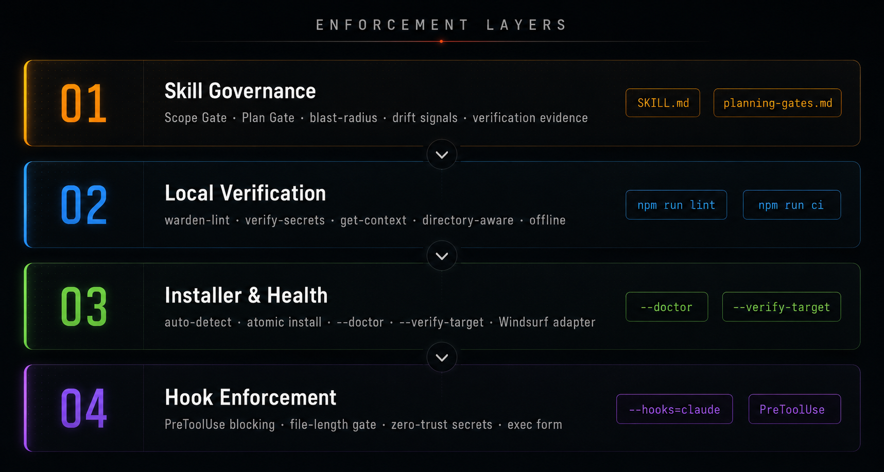
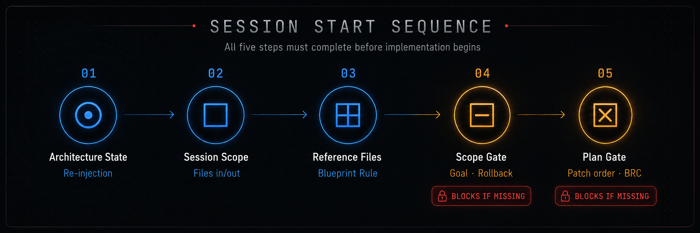
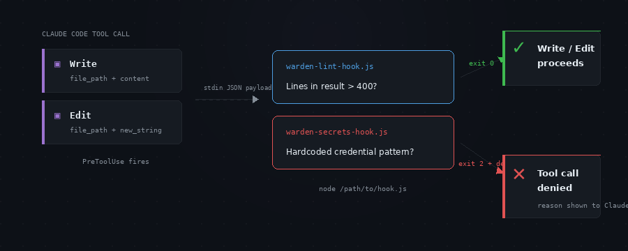

# code-warden

> Portable AI Coding Governance Layer

Code-Warden provides verifiable governance for AI-assisted development.
It does not just ask agents to follow rules. It makes them declare scope,
patch order, blast radius, and verification before code is accepted. Local
checks, CI enforcement, runtime hooks, and report artifacts keep that contract
auditable after the chat scrolls away.

## Four Layers

<p align="center">
  
</p>

| Layer | What it does |
|-------|-------------|
| **Skill governance** | Scope Gate, Plan Gate, blast-radius checks, patch-first editing, research gates, drift signals, verification evidence |
| **Local verification** | `warden-lint`, `verify-secrets`, `get-context` — directory-aware, no external deps |
| **Installer and health** | Cross-app auto-installer, manifest-backed installs, `--doctor`, `--verify-target`, Windsurf adapter |
| **Hard enforcement** | Claude Code `PreToolUse` hooks — block oversized writes and hardcoded secrets before the file system is touched |

## Governance Evidence

Generate a machine-readable governance report that can be stored in CI, attached to PRs, or used as audit evidence:

```bash
node tools/governance-report.js .                   # write .code-warden-report.json + summary
node tools/governance-report.js . --format=json      # JSON to stdout
node tools/governance-report.js . --format=md        # Markdown to stdout
node tools/governance-report.js . --format=sarif     # SARIF to stdout
node tools/governance-report.js . --format=sarif --out=code-warden.sarif
```

The report runs all checks in a single pass (file length, secrets, behavioral tests, source integrity) and produces a structured artifact:

```json
{
  "tool": "code-warden",
  "version": "3.4.0",
  "checks": {
    "fileLength":      { "status": "pass", "filesScanned": 44, "violations": 0 },
    "secrets":         { "status": "pass", "filesScanned": 44, "violations": 0 },
    "behavioralTests": { "status": "pass", "tests": 21, "failures": 0 },
    "installHealth":   { "status": "pass" },
    "riskPolicy":      { "status": "pass" }
  },
  "result": "pass"
}
```

In CI, the Markdown format pipes directly into `$GITHUB_STEP_SUMMARY` for PR-visible evidence:

| Check | Result | Details |
|-------|--------|---------|
| File length | PASS | 44 files scanned, 0 violations |
| Hardcoded credentials | PASS | 44 files scanned, 0 violations |
| Behavioral tests | PASS | 24 tests, 0 failures |
| Install health | PASS | All source files present |
| Risk policy | PASS | 7 governed actions |

See [`templates/ci/github-actions.yml`](templates/ci/github-actions.yml) for the full CI template with artifact upload.

SARIF output is intentionally limited to source-located findings:
`CW001/max-file-length` and `CW002/hardcoded-credential`. The JSON report
remains the canonical governance artifact for behavioral tests, install health,
runtime hook registration, and session gate evidence.

### Governance Receipts

Reports prove repository checks ran. Receipts record the human-confirmed session
contract that happened before edits:

```bash
code-warden receipt --template --out=code-warden-receipt.json
code-warden receipt --validate=code-warden-receipt.json
```

Receipt templates start as `draft` and `canProveCompliance: false`. Validation
only passes after Scope Gate, Plan Gate, and final command evidence fields are
filled. Code-Warden will not claim chat compliance that was not recorded.

### GitHub Action

Use the repository action when you want the shortest CI setup:

```yaml
- name: Code-Warden Governance Gate
  uses: Kodaxadev/Code-Warden@v3
  with:
    path: .
```

The action runs `tools/governance-report.js`, writes
`.code-warden-report.json`, appends a Markdown summary, and uploads the report
artifact by default.

Enable GitHub Code Scanning annotations by adding `sarif: 'true'` and granting
the workflow `security-events: write` permission:

```yaml
permissions:
  contents: read
  security-events: write

steps:
  - uses: actions/checkout@v6
  - name: Code-Warden Governance Gate
    uses: Kodaxadev/Code-Warden@v3
    with:
      path: .
      sarif: 'true'
```

## Install

```bash
npx code-warden init
npx code-warden doctor
npx code-warden verify codex  # or your target runtime
npx code-warden report
```

Or install globally:

```bash
npm install -g code-warden
code-warden init
code-warden doctor
code-warden verify codex  # or your target runtime
code-warden report
```

Optional hard hooks:

```bash
code-warden hooks claude
code-warden hooks codex
code-warden doctor
```

`doctor` verifies installed manifests, hook script paths, and runtime hook
config when hooks are registered. If hook setup is partial, it prints the repair
command to rerun.

Target one runtime when troubleshooting:

```bash
code-warden init --target=codex
code-warden verify codex
code-warden hooks codex
```

### CLI commands

| Command | Purpose |
|---------|---------|
| `code-warden init` | Install to all detected AI runtimes |
| `code-warden report` | Generate governance report |
| `code-warden report --format=md` | Markdown output for PR summaries |
| `code-warden report --format=sarif` | SARIF output for Code Scanning |
| `code-warden report --format=sarif --out=code-warden.sarif` | Write SARIF to a file |
| `code-warden receipt --template --out=code-warden-receipt.json` | Write a draft Scope Gate / Plan Gate receipt |
| `code-warden receipt --validate=code-warden-receipt.json` | Validate completed receipt evidence |
| `code-warden references <paths...>` | Recommend focused governance references for touched paths |
| `code-warden smoke-npx --package=code-warden@latest` | Smoke-test npm package from a clean temp directory |
| `code-warden doctor` | Verify source integrity + install health |
| `code-warden verify <target>` | Strict health check for one runtime |
| `code-warden list` | Show detected runtimes |
| `code-warden hooks claude` | Install Claude Code PreToolUse hooks |
| `code-warden hooks codex` | Install Codex PreToolUse hooks (partial) |
| `code-warden uninstall-hooks claude` | Remove Claude Code hooks |
| `code-warden uninstall-hooks codex` | Remove Codex hooks |

### Direct installer commands

| Command | Purpose |
|---------|---------|
| `node install.js` | Scan, prompt, install to detected apps |
| `node install.js --all` | Install without prompt |
| `node install.js --dry-run` | Preview installs, write nothing |
| `node install.js --list` | Show detected apps and detection method |
| `node install.js --doctor` | Verify source integrity + per-target install health |
| `node install.js --target=claude,cursor` | Force specific targets (warns if not detected) |
| `node install.js --verify-target=claude` | Strict health check — exits nonzero if not installed |
| `node install.js --hooks=claude` | Install PreToolUse hooks into `~/.claude/settings.json` |
| `node install.js --uninstall-hooks=claude` | Remove code-warden hook entries from settings |
| `node install.js --target=codex --all` | Install only the Codex target |
| `node install.js --verify-target=codex` | Strict Codex health check |
| `node install.js --hooks=codex` | Install Codex PreToolUse hooks and enable `[features].hooks` |
| `node install.js --uninstall-hooks=codex` | Remove Codex hook entries |

Supported targets: **Claude Code**, **Cursor**, **Warp**, **OpenAI Codex**, **Windsurf**, **Generic Agents**.

Each install writes a `.code-warden-install.json` manifest (version, target, format, timestamp).

### npm scripts

```bash
npm run lint            # warden-lint on full project tree
npm run check-secrets   # verify-secrets on full project tree
npm run report          # governance report, writes .code-warden-report.json
npm run report:json     # governance report as JSON to stdout
npm run report:md       # governance report as Markdown to stdout
npm run install-auto    # node install.js
npm run install-dry-run # node install.js --dry-run
npm run install-list    # node install.js --list
npm run install-doctor  # node install.js --doctor
npm run smoke:npx       # verify published package from a clean temp directory
npm run test            # behavioral tests (24 scanner/report/receipt/risk/reference/hook cases)
npm run ci              # lint + secrets + test + doctor
```

The public CLI also exposes the package smoke helper:

```bash
code-warden smoke-npx --package=code-warden@latest
```

## Usage

Load at the start of any coding session. Trigger phrases:

- `"load code-warden"` / `"load protocol"`
- `"begin coding"` / `"new session"` / `"governance check"`
- `"start a new module"` / `"review this before we write"`

The session sequence is enforced before any implementation:

<p align="center">
  
</p>

1. Architecture State (Re-injection Rule)
2. Session Scope (Session Scoping Rule)
3. Reference Files (Blueprint Rule)
4. **Scope Gate** — goal, non-goals, files in/out, verify commands, rollback
5. **Plan Gate** — patch order, blast radius class, post-patch checks

See [`examples/governed-session.md`](examples/governed-session.md) for an annotated example.

## Optional Runtime Hooks

<p align="center">
  
</p>

Install hard enforcement that runs at the `PreToolUse` level where the runtime exposes usable surfaces.

```bash
node install.js --hooks=claude  # full Write/Edit coverage
node install.js --hooks=codex   # partial apply_patch/Bash coverage
```

### Claude Code

| Hook | Trigger | Policy |
|------|---------|--------|
| `warden-lint-hook.js` | `Write` or `Edit` | Blocks if resulting file exceeds line limit |
| `warden-secrets-hook.js` | `Write` or `Edit` | Hardcoded credential scanner — blocks if content matches any secret pattern |

### OpenAI Codex

| Hook | Trigger | Policy |
|------|---------|--------|
| `warden-apply-patch-hook.js` | `apply_patch` | Blocks added credentials and estimates resulting file size where a path is extractable |
| `warden-bash-hook.js` | `Bash` | Blocks command strings that contain hardcoded credentials |

Codex cannot hook `Write`/`Edit` directly. CI enforcement closes the remaining gap.
All hooks use exec form (`node /path/to/hook.js`) — no shell differences across platforms.
The Codex installer also enables the current lifecycle-hook feature flag in
`~/.codex/config.toml` and removes the deprecated `[features].codex_hooks`
setting when present:

```toml
[features]
hooks = true
```

Thresholds are read from `codewarden.json` in the installed skill directory.

```bash
node install.js --uninstall-hooks=claude
node install.js --uninstall-hooks=codex
```

Doctor and `--verify-target=<id>` validate hook script paths and Codex hook
feature enablement when hooks are registered, with repair guidance for partial
hook setup.

## Configuration

All thresholds in [`codewarden.json`](codewarden.json):

| Setting | Default | What it controls |
|---------|---------|-----------------|
| `thresholds.max_file_length` | 400 | Lines before `warden-lint.js` flags a file |
| `thresholds.pre_flight_trigger_lines` | 150 | Lines before a pre-flight manifest is required |
| `thresholds.human_checkpoint_files` | 2 | Files touched before `[AWAITING CONFIRMATION]` is required |
| `safety.exempt_from_blast_radius` | `tests/`, `docs/`, `scripts/` | Paths excluded from rollback-plan rule |
| `reference_selection.rules` | 4 path rules | Maps touched paths to focused reference files |
| `external_evidence.providers` | 4 providers | Describes approved external evidence sources and trust limits |
| `risk_policy.actions` | 7 governed actions | Maps action classes to `low`, `medium`, `high`, or `blocked` |

See [`CONFIGURE.md`](CONFIGURE.md) for team-size profiles and tuning rationale.

Default risk policy treats read-only context gathering as `low`, file edits as
`medium`, dependency/network/release operations as `high`, and destructive or
secret-bearing actions as `blocked` until explicitly scoped.

Reference selection is advisory. It helps agents load the right governance
references for touched paths without pretending irrelevant rules disappeared.

External evidence providers are descriptive in this release line. SARIF,
attestations, provenance, and scanner output should be recorded with scope and
trust limits before being treated as governance evidence.

## Reference Files

| File | Domain |
|------|--------|
| `references/planning-gates.md` | Scope Gate and Plan Gate contracts |
| `references/architecture.md` | Blueprint Rule, Re-injection, State Update |
| `references/safety.md` | Blast Radius, Patch-First, Zero-Trust, Dependency Freeze |
| `references/cognition.md` | Think Before Coding, Don't Guess Syntax, Human Checkpoint |
| `references/cleanup.md` | Tech Debt format, Test Contract, Decision Log |
| `references/anti-drift.md` | Anchor Check, Session Scoping, Drift Trigger Protocol |
| `references/operations.md` | Verification, source-control hygiene, dependency control |
| `references/evidence-providers.md` | External scanners, provenance, attestations, CI evidence, trust limits |
| `references/research-and-fit.md` | Live research gate, stack fit, product-shape guardrails |
| `references/mcp-governance.md` | MCP server approval, toolset scope, credentials, consent, audit evidence |

## Note for contributors

> If testing `npx code-warden` from inside the Code-Warden source checkout,
> npm may prefer the local package context. Test from a separate directory for
> the same behavior users will see.

Run the external smoke test to exercise the published package from a clean temp
directory:

```bash
npm run smoke:npx
```

The smoke test runs `npx code-warden@latest --version`, then
`npx code-warden@latest report --format=json`, and verifies the report parses
as a passing Code-Warden result.

## Release Process

Code-Warden releases are tag-driven from GitHub Actions:

1. The workflow checks that `package.json` matches the pushed `vX.Y.Z` tag.
2. `npm run ci` verifies lint, secrets, behavioral tests, and install health.
3. `npm publish --dry-run --access public` verifies the package contents.
4. npm trusted publishing publishes the package without a long-lived npm token.
5. The workflow creates a GitHub release and uploads `code-warden-vX.Y.Z.zip`.

Configure npm trusted publishing for the repository before relying on the
release workflow. Manual publishing remains a fallback, but it should be the
exception because it does not provide the same CI-linked provenance story.

## Author

Justin Davis — MIT License
